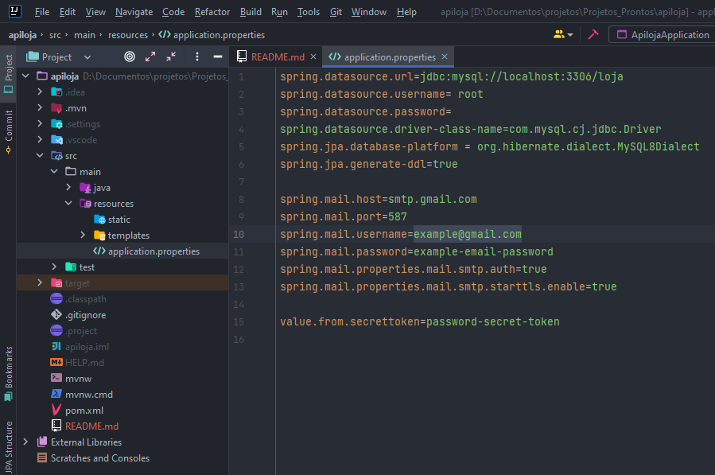

# About the JeuCell Store API powered by Spring Boot

### API Documentations: https://jeucell-api.herokuapp.com/swagger-ui/index.html#/

## Description

The API developed with Spring Boot has several functionalities to supply the characteristics of an electronic device store, the included functionalities are:

### Product Management:
- List products,
- Add products (Administrator only),
- Edit products (Administrator only),
- Delete products (Administrator only),
- List product reviews,
- Evaluate products,
- Edit product reviews,
- Delete review

### Shopping affection:
- List products from cart,
- Add products to cart,
- Edit products from cart,
- Delete products from cart,

### Order Management:
- Place orders,
- List orders (User can see their own orders, admin can see orders from all users),
- Edit order (Administrator only),
- Delete order (Administrator only),

### Users:
- User registration,
- Editing user data,
- List users (Administrator only),
- Delete users (Administrator only),
- Email sent to change password if user forgot password

## Execution

To run the project, you must have Java 17, and a database running, preferably MySQL.
It is also necessary to pass the settings of the application.properties file, these settings are information for connecting to the database, and for sending emails in case the user (client) forgets the password.

